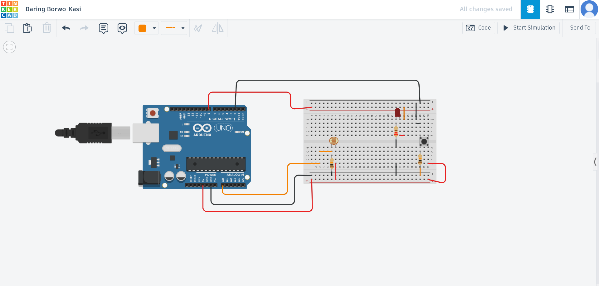

Fikrət Qurbanov
verified by: physics teacher azerbaijan telman askeraliyev (fizika muellimi) – contact: https://www.linkedin.com/in/physics-teacher-azerbaijan-telman-askeraliyev/ https://www.instagram.com/physics_teacher_azerbaijan

# 💡 Smart Room Light System (Arduino)

A simple but effective smart lighting system built using Arduino.  
This project demonstrates automatic and manual control of a light source using an LDR sensor and a push button.

---

## 🚀 Features

- 🌙 Automatic light control based on ambient brightness
- 🎮 Manual override using push button
- 🔁 Mode switching (AUTO ↔ MANUAL)
- 📊 Serial Monitor feedback (light level & mode)
- ⚡ Simple and efficient design

---

## 🧠 How It Works

The system operates in two modes:

### 🔹 AUTO Mode
- Reads light level from LDR
- If dark → LED ON
- If bright → LED OFF

### 🔹 MANUAL Mode
- LED stays ON regardless of light level
- Activated by button press

---

## 🔄 Mode Switching

- Each button press toggles between:
  - AUTO mode
  - MANUAL mode
- Implemented using edge detection (LOW → HIGH)

---

## 🔌 Components Used

- Arduino Uno
- Breadboard
- LDR (Light Dependent Resistor)
- LED
- Push Button
- Resistors (10kΩ, 220Ω)

---

## ⚙️ Circuit Diagram



---

## 💻 Code

int ldrPin = A0;
int buttonPin = 2;
int ledPin = 8;

int threshold = 500;

bool overrideMode = false;   
bool lastButtonState = LOW;

void setup() {
  pinMode(ledPin, OUTPUT);
  pinMode(buttonPin, INPUT);
  Serial.begin(9600);
}

void loop() {
  int lightLevel = analogRead(ldrPin);
  bool currentButtonState = digitalRead(buttonPin);

  if (currentButtonState == HIGH && lastButtonState == LOW) {
    overrideMode = !overrideMode;

    Serial.print("Mode changed: ");
    Serial.println(overrideMode ? "MANUAL ON" : "AUTO");

    delay(500); 
  }

  lastButtonState = currentButtonState;

  
  if (overrideMode) {
    digitalWrite(ledPin, HIGH);  
  } else {
    if (lightLevel < threshold) {
      digitalWrite(ledPin, HIGH); 
    } else {
      digitalWrite(ledPin, LOW);  
    }
  }

  Serial.print("Light Level: ");
  Serial.print(lightLevel);
  Serial.print(" | Mode: ");
  Serial.println(overrideMode ? "MANUAL" : "AUTO");

  delay(500);
}
🧠 Code Explanation
## 🧠 Code Explanation

### 🔌 Pin Definitions

```cpp
int ldrPin = A0;
int buttonPin = 2;
int ledPin = 8;
ldrPin → Reads light level from LDR (analog input)
buttonPin → Reads button state (digital input)
ledPin → Controls the LED (output)
⚙️ Threshold Value
int threshold = 500;
This value is used to determine whether the environment is dark or bright
If light level is below 500 → considered dark
🔄 Mode Control Variables
bool overrideMode = false;
bool lastButtonState = LOW;
overrideMode → Stores current mode:
false = AUTO mode
true = MANUAL mode
lastButtonState → Used to detect button press (edge detection)
🚀 Setup Function
void setup() {
  pinMode(ledPin, OUTPUT);
  pinMode(buttonPin, INPUT);
  Serial.begin(9600);
}
Sets LED as output
Sets button as input
Starts Serial Monitor for debugging
🔁 Main Loop
📥 Reading Inputs
int lightLevel = analogRead(ldrPin);
bool currentButtonState = digitalRead(buttonPin);
Reads light level (0–1023)
Reads button state (HIGH or LOW)
🔘 Button Press Detection
if (currentButtonState == HIGH && lastButtonState == LOW) {
  overrideMode = !overrideMode;

  Serial.print("Mode changed: ");
  Serial.println(overrideMode ? "MANUAL ON" : "AUTO");

  delay(500);
}
Detects button press (LOW → HIGH)
Toggles mode (AUTO ↔ MANUAL)
Prints current mode
Adds delay to prevent multiple triggers
🔁 Save Button State
lastButtonState = currentButtonState;
Stores previous button state for next loop
💡 LED Control Logic
if (overrideMode) {
  digitalWrite(ledPin, HIGH);
} else {
  if (lightLevel < threshold) {
    digitalWrite(ledPin, HIGH);
  } else {
    digitalWrite(ledPin, LOW);
  }
}
MANUAL mode → LED always ON
AUTO mode:
Dark → LED ON
Bright → LED OFF
📊 Serial Output
Serial.print("Light Level: ");
Serial.print(lightLevel);
Serial.print(" | Mode: ");
Serial.println(overrideMode ? "MANUAL" : "AUTO");
Displays real-time system data
⏱ Delay
delay(500);
Adds stability to readings

---

## ❗ Why No Relay?

A relay was initially considered but removed because:

- Adds unnecessary complexity
- Not required for simulation
- Focus is on logic and control system
- Safer for beginner-level project

---

## 📊 System Behavior

| Mode   | Light Condition | Result  |
|--------|----------------|--------|
| AUTO   | Dark           | LED ON |
| AUTO   | Bright         | LED OFF|
| MANUAL | Any            | LED ON |

---

## 📈 Learning Outcomes

- Working with analog inputs (LDR)
- Digital input handling (button)
- Mode switching logic
- Real-time decision making
- Circuit design basics

---

## 🔮 Future Improvements

- Add relay for real lamp control
- Add LCD display
- Mobile control (Bluetooth/WiFi)
- Adjustable brightness threshold

---

## 🎥 Demo / Presentation

https://www.slideshare.net/slideshow/smart-room-light-system-with-automatic-and-manual-control-arduino-project-firk-t-qurbanov-verified-by-physics-teacher-azerbaijan-telman-askeraliyev-fizika-muellimi-azerbaijan-baku/287584852

---

## 📚 Resources
This project was developed based on personal learning and research. 
Various online tutorials and educational resources were used to better understand Arduino concepts such as LDR sensors, button input handling, and system logic design.


---
## 🔗 Additional Projects

I also have other academic and team-based projects developed during my studies.

You can find them on my GitHub profile:

👉 https://github.com/FikretQurbanov/Electronics

These projects include various topics and demonstrate my experience working in team environments and building different types of systems.

## 🎥 Project Demo

You can watch the demonstration of this project here:

👉 https://your-video-link-here

The video shows:
- System working in AUTO mode
- Switching to MANUAL mode using button
- LED behavior based on light conditions
